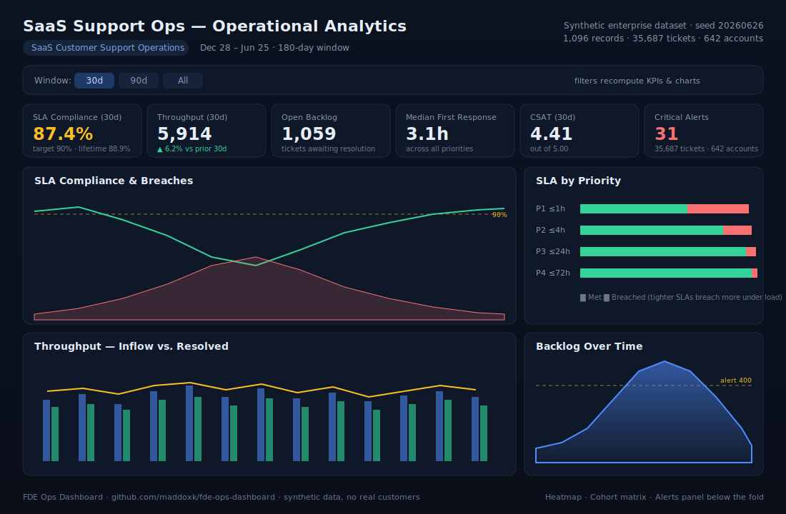

# FDE Ops Dashboard — SaaS Support Operations Analytics

A customer-facing **operational analytics dashboard** for a SaaS customer-support
organization, built the way a **forward-deployed engineer** would ship it at a customer:
a static React + Vite + TypeScript front-end over a **bundled synthetic enterprise
dataset**, plus the **infrastructure-as-code** (Dockerfile, docker-compose, Terraform)
showing how it would be deployed on-prem or in a customer's cloud account.

**Live demo:** https://maddoxk.github.io/fde-ops-dashboard/



> The preview above is an SVG mock of the layout. The live link renders the real
> interactive dashboard (Recharts) over the committed dataset.

---

## Overview

The dashboard answers the questions a support-operations leader (and the account team
embedded with them) actually asks day to day:

- **SLAs** — Are we meeting first-response SLA targets per priority tier? Where are we
  breaching, and how does it track against the 90% target line?
- **Throughput** — How does daily ticket inflow compare to what the team resolves, given
  current agent capacity? Weekly seasonality (weekday surge / weekend lull) is visible.
- **Backlog** — How is the open-ticket backlog trending? A mid-period staffing crunch
  drives it up before a hiring wave recovers it; an alert threshold sits at 400.
- **Cohorts / heatmap** — A signup-cohort matrix of tickets-per-account by account age
  (onboarding intensity decays over time), and a day-of-week × hour-of-day volume heatmap.
- **Alerts** — Threshold-based operational alerts (SLA compliance, backlog growth, slow
  first response) derived from the daily series, most recent first.
- **Filters** — A time-window selector (30 / 90 / All days) recomputes the KPI strip and
  every time-series chart in place.

### Panels

| Panel | What it shows |
| --- | --- |
| KPI strip | SLA compliance (30d), throughput, open backlog, median first response, CSAT, critical alerts — each with deltas vs. the prior period |
| SLA Compliance & Breaches | Daily compliance % (line) vs. breached-ticket count (area), with a 90% target reference line |
| SLA by Priority | Met vs. breached first-response volume per P1–P4 tier |
| Throughput | Inflow vs. resolved bars with a capacity overlay |
| Backlog Over Time | Open backlog area chart with a 400-ticket alert threshold |
| Day × Hour Heatmap | Ticket volume by day-of-week and hour-of-day |
| Cohort Matrix | Tickets-per-account by signup cohort and account age |
| Alerts | Threshold-breach events, severity-coded |

---

## Dataset & generator

There is **no live backend** — everything renders over a single bundled JSON file that is
produced by a deterministic generator and **committed to the repo** so every build is
reproducible.

- **Generator:** [`scripts/generate-data.mjs`](scripts/generate-data.mjs) — a seeded
  (`mulberry32`, seed `20260626`) Node script. Regenerate with `npm run gen`.
- **Output:** [`src/data/dataset.json`](src/data/dataset.json) (~400 KB).

The generator models believable enterprise patterns rather than random noise:

- **Weekly seasonality** — weekdays carry ~2× the volume of weekends.
- **Per-priority SLA targets** — P1 ≤ 1h, P2 ≤ 4h, P3 ≤ 24h, P4 ≤ 72h; breach probability
  rises as the daily load (inflow / capacity) exceeds ~0.85, and tighter SLAs (P1) breach
  first.
- **Staffing crunch** — agent capacity dips between roughly day 55 and day 110 (attrition),
  recovering after a hiring wave around day 120; backlog accumulates then drains in response.
- **Customer cohorts** — newer signup cohorts are larger but file more tickets per account;
  intensity decays with account age (onboarding pain fades).
- **Derived alerts** — SLA-compliance, backlog-growth, and slow-first-response thresholds.

Record counts (current seed): **180** daily points, **168** heatmap cells (7×24),
**12** cohorts, **600** sample tickets, **136** alerts — **1,096** records total,
representing **35,687** synthetic tickets across **642** accounts over a 180-day window.

> All data is synthetic. No real customers, accounts, or PII.

---

## Tech stack

- **React 18** + **TypeScript 5** + **Vite 5** (pinned to 5 for Node 18 compatibility)
- **Recharts** for charts
- **Vitest** + **Testing Library** + **jsdom** for tests
- **GitHub Actions** → **GitHub Pages** for deployment
- **Docker** (multi-stage build → nginx) + **docker-compose** + **Terraform** for the
  customer-deployment IaC story

---

## Run locally

```bash
npm install
npm run gen      # (re)generate src/data/dataset.json — already committed
npm run dev      # http://localhost:5173/fde-ops-dashboard/
```

Build and test:

```bash
npm run build    # tsc -b && vite build  -> ./dist
npm test         # vitest run
npm run preview  # serve the production build
```

---

## Deployment / IaC notes

### GitHub Pages (this repo's live demo)

`.github/workflows/pages.yml` builds the site with `base: '/fde-ops-dashboard/'`, writes a
`.nojekyll` marker, and publishes `./dist` via the official Pages actions. The base path is
required because the site is served from a subpath
(`https://maddoxk.github.io/fde-ops-dashboard/`); without it, assets 404.

### Customer deployment (on-prem / private cloud)

Because the app is a static bundle, it drops cleanly into a customer's environment:

```bash
# Build the image and serve via nginx at http://localhost:8080
docker compose up --build
```

- **[`Dockerfile`](Dockerfile)** — multi-stage: Node 20 build stage (`--base=/` so it serves
  from root inside the container) → `nginx:alpine` serve stage with a healthcheck.
- **[`docker-compose.yml`](docker-compose.yml)** — single `dashboard` service on port 8080.
- **[`infra/nginx.conf`](infra/nginx.conf)** — static-asset serving + SPA fallback.
- **[`infra/terraform/`](infra/terraform/)** — a Terraform **stub** describing an
  S3 + CloudFront static-hosting deployment (bucket, OAC, distribution, variables, outputs).
  It is intentionally a stub (no real state/backend) to show the shape of a cloud rollout.

---

## Tests

`src/test/App.test.tsx` covers dataset integrity (shape, record counts, SLA bounds) and that
the app renders the header, KPI strip, and every dashboard panel. Run with `npm test`.

---

## License

MIT © 2026 Maddox Krape — see [LICENSE](LICENSE).
